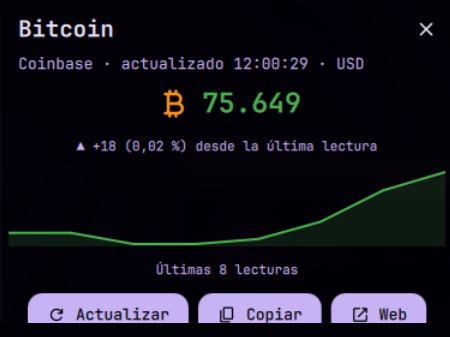

# dmsbtc — Monitor de precio de Bitcoin para DankMaterialShell

[English](README.md) · **[Español](README.es.md)**


Plugin para DankMaterialShell (`dms`) que te muestra el precio de Bitcoin en la barra y se adapta al tema, a la moneda y al intervalo que elijas.



*Click en la píldora de la barra (abajo) para abrir el popout de arriba: precio en vivo, variación desde la última lectura y un mini gráfico de las últimas lecturas.*


## ¿Qué onda este plugin?

*   **Precio en la barra:** se actualiza cada un minuto por defecto, configurable de 15 segundos a 10 minutos.
*   **Aguante a fallos:** si un proveedor de precio se cae, el plugin rota automáticamente entre CoinGecko, Coinbase y Blockchain.info. Si un proveedor no puede cotizar la moneda que elegiste, lo descarta en vez de mostrarte un precio en otra moneda. ¡Un caño!
*   **Tendencia visual:** si el precio sube se pone verde con ▲, si baja se pone rojo con ▼, durante el tiempo que definas.
*   **Popout:** click en la píldora y tenés el precio grande, la variación desde la última lectura, un mini gráfico de las últimas lecturas, el proveedor que está respondiendo y botones para refrescar, copiar el precio o abrir CoinGecko.
*   **Respeta el tema:** usa los colores, tamaños y espaciados de DMS, así que se ve bien en tema claro u oscuro y con cualquier color de acento.
*   **Sin dependencias:** no necesita `curl` ni ningún binario externo.

## Instalación

1.  Copiá esta carpeta en `~/.config/DankMaterialShell/plugins/dmsbtc/`.
2.  `dms restart` y activalo desde la configuración.

## Configuración

Todo se configura desde **Ajustes → Plugins → BTC Price Monitor**. No hace falta tocar el QML.

| Ajuste | Por defecto | Qué hace |
| --- | --- | --- |
| Moneda | USD | USD, EUR, GBP, BRL, ARS, CLP, JPY |
| Actualizar cada | 60 s | Cada cuánto consulta el precio (15 s a 600 s) |
| Duración del destello | 60 s | Cuánto dura el verde/rojo después de un cambio (0 = sin destello) |
| Mostrar tendencia | Sí | Agrega ▲ o ▼ al lado del precio cuando cambia |
| Precio en barra vertical | Sí | Muestra el precio abreviado debajo del ícono |
| Color cuando sube | Éxito del tema | Se usa en el precio y en la flecha ▲ |
| Color cuando baja | Error del tema | Se usa en el precio y en la flecha ▼ |
| Color del ícono ₿ | `#F7931A` | El naranja de Bitcoin, o el color primario del tema |

## Desarrollo

El plugin se recarga en caliente, sin reiniciar el shell:

```bash
dms ipc call plugins reload btcPriceMonitor   # recarga después de editar el QML
dms ipc call plugins list                     # lista los plugins cargados
dms ipc call plugins status btcPriceMonitor   # estado del plugin
```

Para autocompletado y chequeo de tipos del QML, abrí el proyecto dentro de un clon de [DankMaterialShell](https://github.com/AvengeMedia/DankMaterialShell) con el submódulo `dank-qml-common`.

## Autor

by kastor
