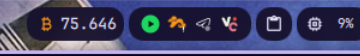

# dmsbtc plugin -  Monitor de Precio de Bitcoin para DMS

Este es un plugin para Quickshell que te muestra el precio de Bitcoin al toque en tu barra de tareas de DankMaterialShell (`dms`).

## ¿Qué onda este plugin?

*   **Precio en tiempo real:** Se actualiza cada un minuto por defecto para que no se te pase ninguna.
*   **Aguante a fallos:** Si un proveedor de precio se cae, el plugin rota automáticamente entre CoinGecko, Coinbase y Blockchain.info. ¡Un caño!
*   **Estética:** Si el precio sube, se pone verde. Si baja, se pone rojo. Bien visual para que sepas qué está pasando de un vistazo.

## Instalación

1.  Copiá esta carpeta en `/home/tu-usuario/.config/DankMaterialShell/plugins/dmsbtc/`.
2.  Reiniciá `dms` y activalo desde la configuración.

## Configuración

Podés meter mano en `BtcPrice.qml` para cambiar estas cosas:

*   `currency`: Por defecto está en `usd`, pero si querés podés mandarle la moneda que más te guste.
*   `updateInterval`: El tiempo entre cada actualización (en milisegundos).

## Autor

by kastor
